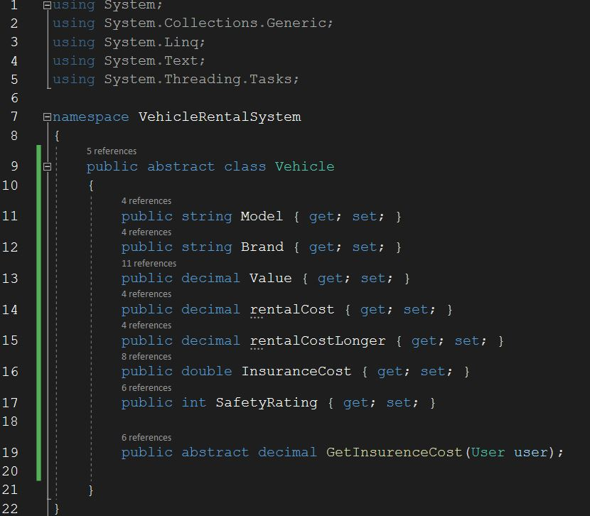
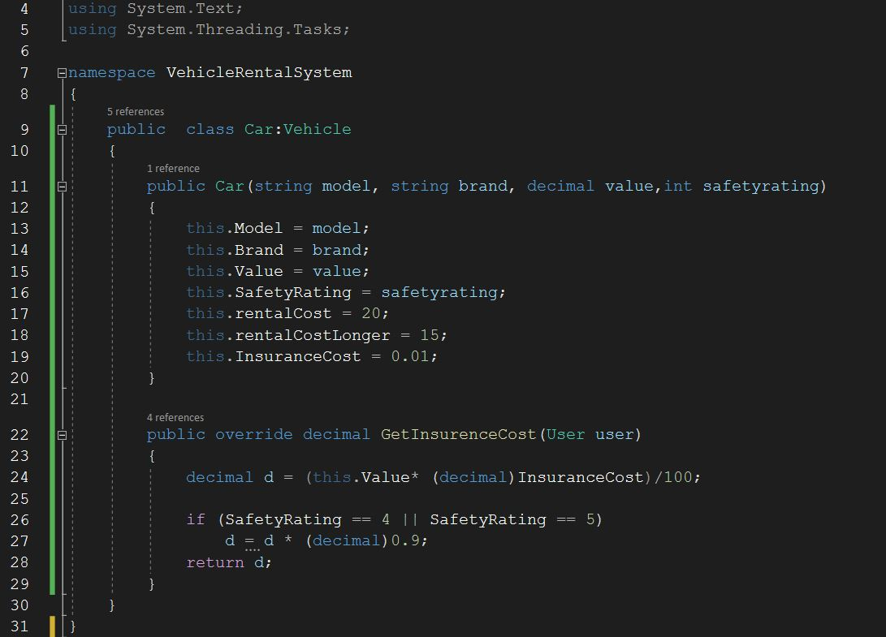
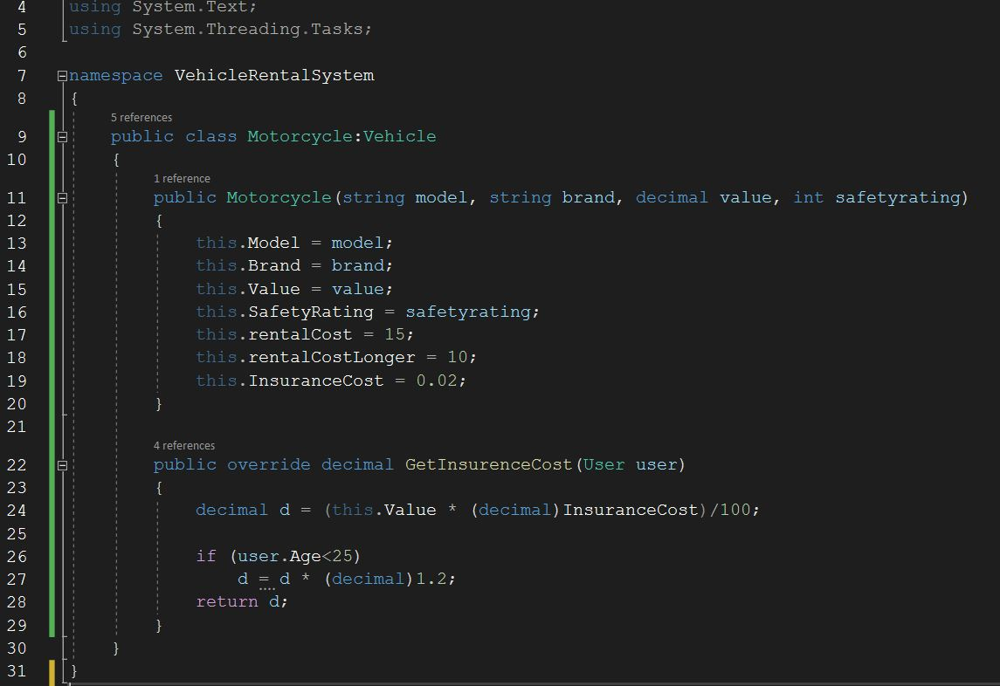
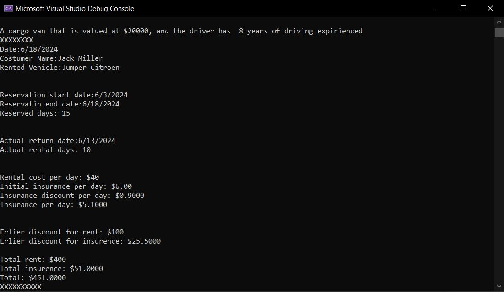

# Vehicle Rental System

## Application description

Using the C# programming language, an application was implemented that should simulate a vehicle rental system. 
It is a simple console application in which the see console is used only for printing and displaying results while no data input is expected from the user. 
The entire system was created using object-oriented principles with the use of a total of 6 classes, one of which is abstract and a program that should illustrate the operation of the system.

## Vehicle class
This is an abstract class used to derive the other vehicle types in the system. This class stores the basic attributes set by the specification
and has an abstract function for recalculating the insurance, which will later be predefined in each of the vehicle types.

## Car class
The Car class inherits the Vehicle class and implements an abstract function for calculating insurance.
The class also sets values ​​for the rental price for a long period of $15 and a short period of $20.

## Motorcycle class

The Motorcycle class inherits the Vehicle class and implements an abstract function for calculating insurance. 
The class also sets values ​​for the rental price for a long period of $10 and a short period of $15.

## Cargo Van Class

The Cargo Van class inherits the Vehicle class and implements an abstract function for calculating insurance.
The class also sets values ​​for the rental price for a long period of $$0 and a short period of $50.

