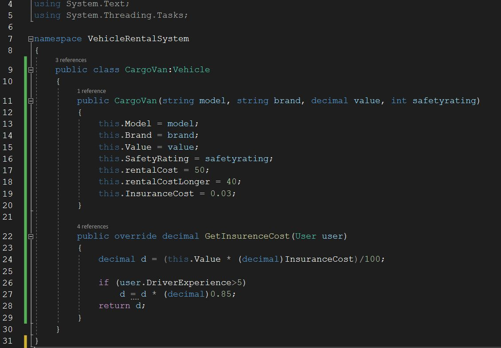
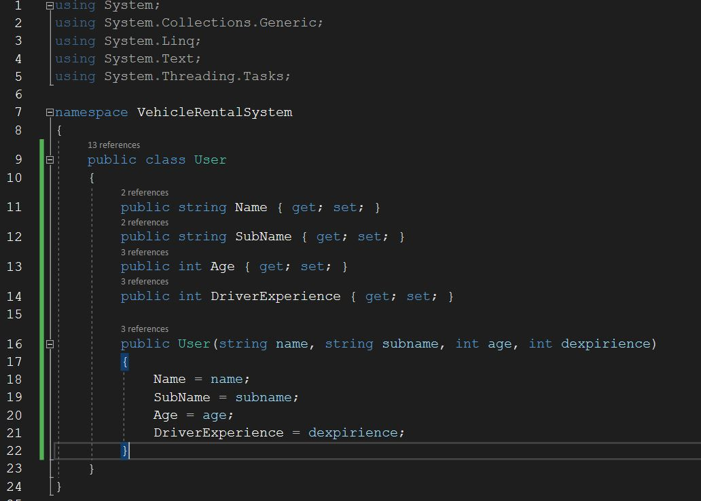
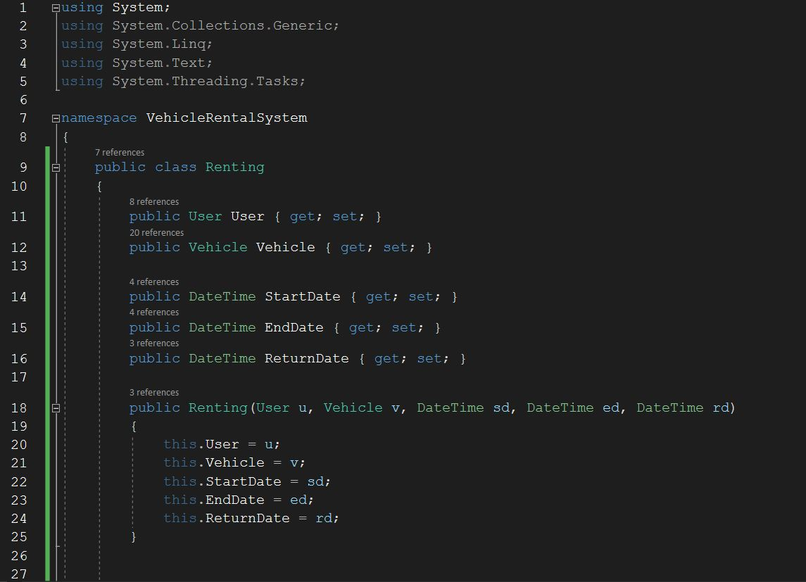
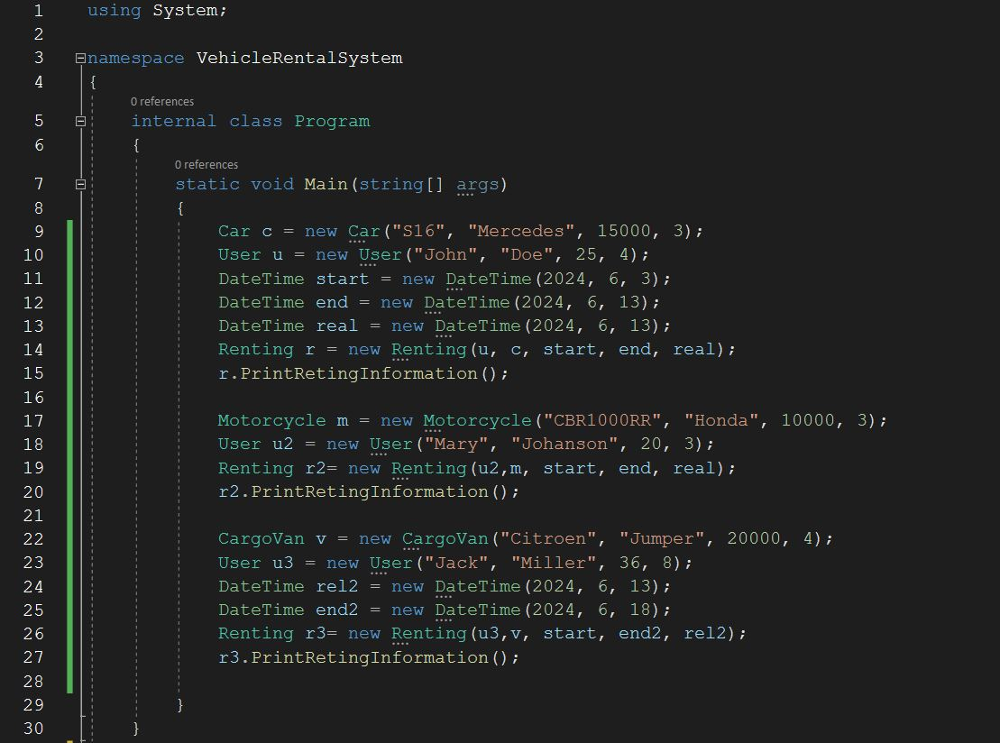
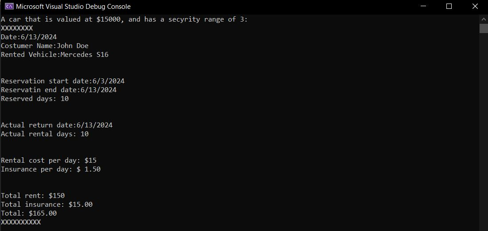

# Vehicle Rental System

## Application description

Using the C# programming language, an application was implemented that should simulate a vehicle rental system. 
It is a simple console application in which the see console is used only for printing and displaying results while no data input is expected from the user. 
The entire system was created using object-oriented principles with the use of a total of 6 classes, one of which is abstract and a program that should illustrate the operation of the system.

## Vehicle class
This is an abstract class used to derive the other vehicle types in the system. This class stores the basic attributes set by the specification
and has an abstract function for recalculating the insurance, which will later be predefined in each of the vehicle types.

## Car class
The Car class inherits the Vehicle class and implements an abstract function for calculating insurance.
The class also sets values ​​for the rental price for a long period of $15 and a short period of $20.

## Motorcycle class

The Motorcycle class inherits the Vehicle class and implements an abstract function for calculating insurance. 
The class also sets values ​​for the rental price for a long period of $10 and a short period of $15.

## Cargo Van Class

The Cargo Van class inherits the Vehicle class and implements an abstract function for calculating insurance.
The class also sets values ​​for the rental price for a long period of $40 and a short period of $50.

## User Class

This class is intended for creating users who will actually use the services of the car rental service. The user has attributes such as first name, last name, ages and driving experience. 
The attributes of ages and driving experience are used to calculate the insurance price in some vehicle classes.

## Renting Class

The Renting Class is used to connect the User Class and the class of different types of Vehicles.
In addition to the user and the vehicle, this class also has the rental start date, the rental end date, and the vehicle return date. 
This class also has a function for printing rental information in relation to the type of vehicle and user, specific printing is done,
the detailed implementation of which is given in the code, while only part of the Renting class is shown in the picture.

## Program.cs
Several vehicles of different types and several users have been created here, in order to illustrate the operation of the system. 
In order to easily check the correctness of the system operation, the values ​​given in the task requirements were used.

## Appearance of the console when starting the program

In the following pictures, you can see what information the program gives us for created users, vehicles and rentals.

